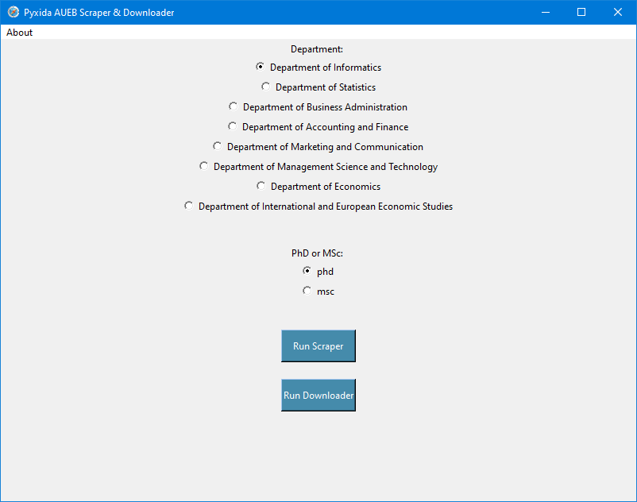

# Pyxida Scraper
A web scrapper tool to easily extract links from the Pyxida AUEB Institutional Repository.
The urls extracted contain MSc and PhD dissertations, in `.pdf` format, from all the departments of AUEB.

Visit:
[http://www.pyxida.aueb.gr](http://www.pyxida.aueb.gr)


## How to run

First, install all requirements:
```shell
pip install -r requirements.txt
```

Change directory to `src` folder.

**Step 1**
Run:
```shell
python pyxida_scraper.py
```

**Step 2**
Run:
```shell
python pyxida_downloader.py
```

## GUI



You can simply open and run the GUI application.
Run:
```shell
python pyxida_gui.py
```

## Create executable with pyinstaller

You can make an executable file for the GUI.
First, install the required library `pyinstaller`:
```shell
pip install pyinstaller
```

Then, run:
```shell
pyinstaller pyxida_gui.spec
```

Go to `dist/pyxida_gui`.
And then run the created file `pyxida_gui.exe`!
Now, you can download all the dissertations you want easily!
