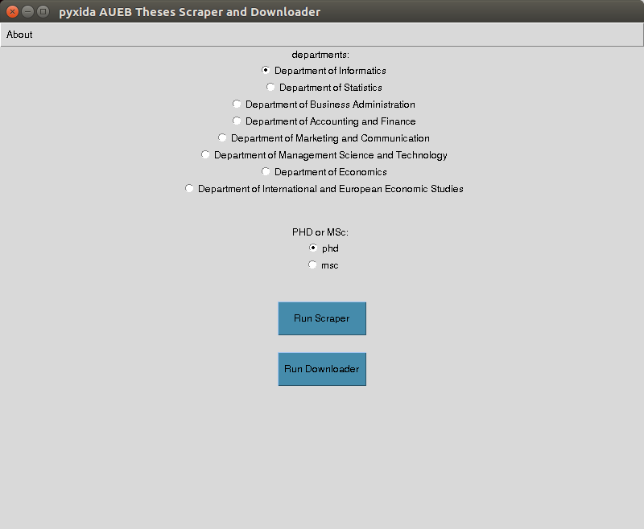

# PyxidaAuebThesesScraper
A web scrapper tool to easily extract links from the Pyxida Institutional Repository. The urls extracted contain MSc and PhD theses, in ".pdf" format, from all the departments of AUEB.

Visit:
[http://www.pyxida.aueb.gr](http://www.pyxida.aueb.gr)


## How to run


**Step 1**
Run:
```shell
python pyxida_aueb_scraper.py
```

**Step 2**
Run:
```shell
python pyxida_aueb_downloader.py
```

## GUI



You can simply open and run the GUI application.
Run:
```shell
python pyxida_gui.py
```

or

You to make an executable file for the gui. Run:
```shell
pip install pyinstaller
pyinstaller pyxida_gui.spec
```
And then run the created file "pyxida_gui.exe"!
Now, you can download all the theses you want easily!
